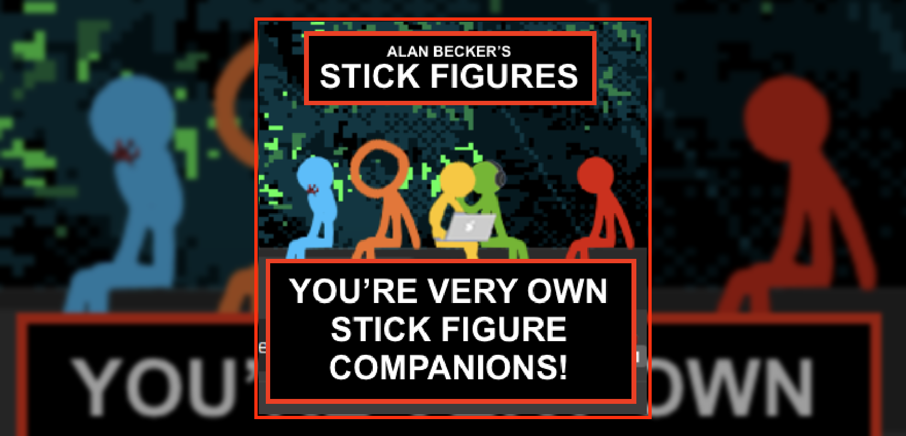
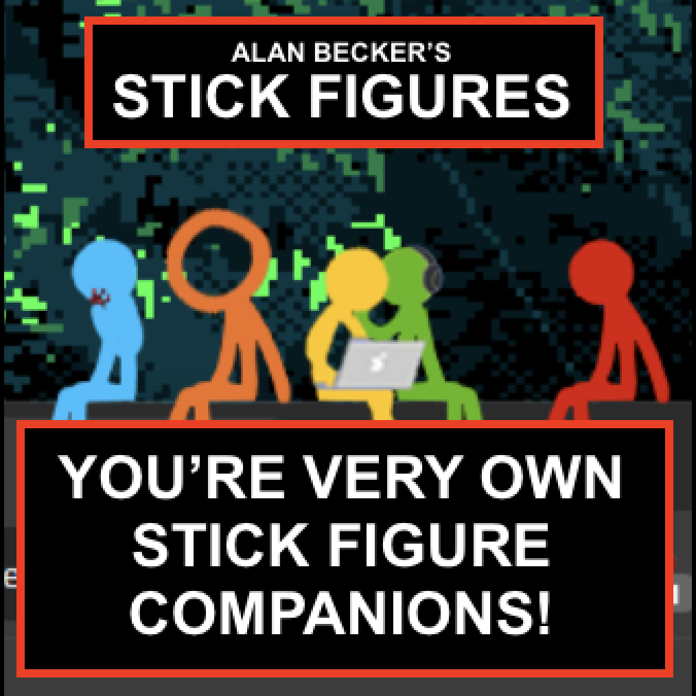

<p align="center">

</p>

<p align="center">
    
</p>

## Introduction

### **Disclaimer: This is an unofficial version and is not endorsed or affiliated with Alan Becker.**

### **Note: This application is supported for Windows and macOS. Linux is not supported.**

This is a customised stand-alone app of Kilkakon's Shimeji-ees dedicated towards providing an easy way to download, install and receive updates for Alan Becker's suite of stickfigures to roam around and give you company on your desktop. The animations, behaviours and actions are all created and provided by [**Stickwave/@StickLaserPhase**](https://x.com/StickLaserPhase) (Thank you so much!) with my own little tweaks.

## Installation Guide

### Runtime Requirements

macOS release builds are native Swift/AppKit apps and do not require Java.

Windows builds use the original Java stickfigure runtime packaged into the installer. Local Windows development still needs JDK 17+ when building the `.exe`.

### Download Link

Download the installer from the latest release: [**alan-beckers-stickfigures-installer**](https://github.com/Skittlq/alan-beckers-stickfigures-unofficial/releases/latest).

### Installation and Running the Application / Updating the Application

#### Windows

1. If updating, exit out of the app by either dismissing all stickfigures, or exiting out from the system tray icon.
2. Download the installer.
3. Run the installer and follow the on-screen instructions.
4. The application will automatically add itself as a shortcut to the Start Menu, Desktop, and will start up automatically when you turn on your computer.
5. Use the tray menu's **Choose Stickfigure...** action, or edit `conf/settings.properties`, to choose which stickfigure sets are active.

#### macOS

1. Download the macOS DMG from the latest GitHub release.
2. Open the DMG and drag `Alan Beckers Stickfigures.app` to Applications.
3. Open the app. It shows a settings/status window and adds an `ABS` item to the macOS menu bar.
4. Use the menu bar item to turn the stickfigures on or off, restart them, open logs, or quit the app.
5. In Settings, check only the stickfigure colors you want enabled. Disabled stickfigures are hidden immediately when the native engine restarts.
6. Public release builds are signed and notarized so macOS can verify them. Local development builds are ad-hoc signed and may require Control-click, **Open**, then confirm.

macOS launcher output is written to `~/Library/Logs/AlanBeckersStickfigures.log`.

### Shared Desktop Features

- Windows and macOS both ship the same stickfigure image sets, behavior files, and artwork.
- Right-click a stickfigure and choose **Hold Pointer** to make only that stickfigure hold onto the mouse pointer until you release it.
- On Windows, enabled stickfigure sets are controlled by `ActiveShimeji` in `conf/settings.properties`.
- On macOS, enabled stickfigure sets are controlled from the native settings window and stored in macOS user defaults.
- Windows keeps the original Shimeji-ee Java runtime and native window support. macOS now uses a native Swift/AppKit sprite engine for smoother transparent overlay windows.

### Local AI Behavior

The native macOS app can optionally use a local Ollama model for dynamic
behavior choices. This is disabled by default and does not send screenshots,
window titles, or desktop content to the model. The app only sends the
stickfigure name, current action, supported action names, nearby-character
metadata, and sanitized desktop context such as wall distance, Dock/window
surface type, and mouse distance.

In **Settings**:

1. Enable **Local AI**.
2. Set the Ollama URL, usually `http://127.0.0.1:11434`.
3. Click **Load Models**.
4. Choose a chat-capable model such as `granite4.1:3b`.

The app filters out embedding-only Ollama models because they cannot answer
chat/action requests. AI behavior is constrained to sprite-backed actions each
character actually supports, including common actions such as walk, run, dash,
trip, dance, sit poses, sprawl, chase mouse, and victim-specific cursor/lasso
actions when those sprites are present. A built-in story director turns those
actions into spaced-out role-play beats instead of constantly firing random AI
actions. Scenes include color-gang warmups, playful chases, TCO/TDL rivalry,
victim schemes, watch-and-react moments, celebrations, and quiet resets.

The role-play system also creates dynamic two-character composite interactions
such as follow-the-leader, copycat poses, guarding/watching, ambush/prank beats,
playful chases, short sparring/fighting beats, teasing, observing, and shared
celebrations. These interactions are built from the shipped sprites and are
biased by story relationships, such as TCO/TDL rivalry, victim's suspicious
behavior, and the color gang's playfulness. While a story beat is active,
per-character model suggestions are paused; between scenes, one-off suggestions
are throttled so the desktop behavior stays readable.

If model loading hangs on `127.0.0.1:11434`, check for a port conflict:

```bash
lsof -nP -iTCP:11434 -sTCP:LISTEN
curl http://127.0.0.1:11434/api/tags
```

Only Ollama should own that local API port. A stale editor port-forward or
helper process can intercept `127.0.0.1:11434` and make Ollama look broken even
when the Ollama app is running.

### macOS Desktop Notes

The macOS app treats all connected displays as one continuous desktop, keeps the menu bar as a real top edge, and keeps stickfigures above normal app windows and the visible Dock. The native engine passively reads normal window bounds so stickfigures can land, sit, fall, and walk on top of windows. It estimates the visible Dock surface and ignores the Dock's invisible reserved strip so figures do not hover on empty space.

The previous Java-backed macOS implementation is preserved on the `codex/java-macos-backup-before-swift-rewrite` branch for reference.

### macOS Development Build

Build and run the local macOS app:

```bash
./script/build_and_run.sh --verify
```

Build the distributable DMG:

```bash
./script/package_macos.sh
```

The DMG is written to `dist/Alan-Beckers-Stickfigures-macOS.dmg`. The local app is ad-hoc signed for validation, but not notarized unless the notarization environment variables below are provided.
The local `dist/` directory is ignored by Git.

For a public macOS release that opens normally on other Macs, build with a Developer ID Application certificate and notarization credentials:

```bash
MACOS_CODESIGN_IDENTITY="Developer ID Application: Your Name (TEAMID)" \
MACOS_REQUIRE_NOTARIZATION=1 \
MACOS_NOTARIZE=1 \
MACOS_NOTARY_KEY_ID="KEYID" \
MACOS_NOTARY_ISSUER_ID="ISSUER-UUID" \
MACOS_NOTARY_KEY_PATH="/path/to/AuthKey_KEYID.p8" \
./script/package_macos.sh
```

Use a Team API key from App Store Connect for `notarytool`; individual keys do not work for release notarization. Apple ID notarization also works by replacing the API key variables with `MACOS_NOTARY_APPLE_ID`, `MACOS_NOTARY_TEAM_ID`, and `MACOS_NOTARY_PASSWORD` using an app-specific password.

### Mac App Store Build

The notarized DMG above is for direct distribution and should be kept. The Mac App Store is a separate distribution path: Apple requires a signed installer package uploaded to an existing App Store Connect macOS app record.

Before building the App Store package:

- Create the macOS app record in App Store Connect for bundle ID `com.skittlq.alanbeckersstickfigures.unofficial`.
- Create/download a `Mac App Store Connect` provisioning profile for that explicit bundle ID.
- Install an `Apple Distribution` or `3rd Party Mac Developer Application` signing identity.
- Install a `3rd Party Mac Developer Installer` identity.

Build the App Store package:

```bash
APP_VERSION=1.0.1 \
BUILD_NUMBER=3 \
MACOS_APP_STORE_CODESIGN_IDENTITY="Apple Distribution: Your Name (TEAMID)" \
MACOS_APP_STORE_INSTALLER_IDENTITY="3rd Party Mac Developer Installer: Your Name (TEAMID)" \
MACOS_APP_STORE_PROVISIONING_PROFILE="/path/to/profile.provisionprofile" \
./script/package_macos_app_store.sh
```

The package is written to `dist/Alan-Beckers-Stickfigures-Mac-App-Store.pkg`.
This package is for App Store Connect upload only. Do not use it as a local
test installer: macOS can kill the app at launch with "no eligible provisioning
profiles found" until the app comes through the App Store/TestFlight flow. Use
the notarized DMG from `./script/package_macos.sh` for local user testing and
direct downloads.

After App Store Connect creates the app and shows its numeric Apple ID, upload the package:

```bash
MACOS_APP_STORE_APPLE_ID="1234567890" \
MACOS_APP_STORE_API_KEY_ID="KEYID" \
MACOS_APP_STORE_API_ISSUER_ID="ISSUER-UUID" \
MACOS_APP_STORE_API_KEY_PATH="/path/to/AuthKey_KEYID.p8" \
./script/upload_macos_app_store.sh
```

Apple review may still require product-page metadata, screenshots, a privacy policy URL, and approval for the app's desktop overlay/window-awareness behavior.

### Windows Development Build

Build the Windows installer on Windows with JDK 17+ and WiX Toolset installed:

```powershell
.\script\package_windows.ps1
```

The installer is written to `dist/Alan-Beckers-Stickfigures-Windows.exe`.
The package script includes the repository `LICENSE` in the installer when it is
present. That license text is not the same thing as Windows trust: Microsoft
Defender SmartScreen warnings are controlled by Authenticode signing and app /
publisher reputation, not by whether the installer has a license page.

For a public Windows release, sign the installer with a trusted code-signing
certificate:

```powershell
$env:WINDOWS_REQUIRE_SIGNING = "1"
$env:WINDOWS_CODESIGN_PFX_PATH = "C:\path\to\CodeSigningCertificate.pfx"
$env:WINDOWS_CODESIGN_PFX_PASSWORD = "certificate-password"
.\script\package_windows.ps1 -Version 1.0.1
```

### GitHub Releases

`.github/workflows/release.yml` builds release assets when a tag like `v1.0.0` is pushed, or when the workflow is run manually. The GitHub release includes:

- `Alan-Beckers-Stickfigures-macOS.dmg`
- `Alan-Beckers-Stickfigures-Windows.exe`
- `Alan-Beckers-Stickfigures-source-<tag>.zip`
- GitHub's standard Source code archives for the tag

macOS release builds require these GitHub Actions secrets before tagging:

- `MACOS_CERTIFICATE_P12`: base64 of the exported Developer ID Application `.p12`
- `MACOS_CERTIFICATE_PASSWORD`: password for that `.p12`
- `MACOS_CODESIGN_IDENTITY`: full signing identity, for example `Developer ID Application: Your Name (TEAMID)`
- `MACOS_KEYCHAIN_PASSWORD`: optional temporary CI keychain password
- Team API-key notarization: `MACOS_NOTARY_KEY`, `MACOS_NOTARY_KEY_ID`, `MACOS_NOTARY_ISSUER_ID`
- Or Apple ID notarization: `MACOS_NOTARY_APPLE_ID`, `MACOS_NOTARY_TEAM_ID`, `MACOS_NOTARY_PASSWORD`

Windows release builds require these GitHub Actions secrets before tagging:

- `WINDOWS_CODESIGN_PFX_B64`: base64 of the exported Windows code-signing `.pfx`
- `WINDOWS_CODESIGN_PFX_PASSWORD`: password for that `.pfx`
- Optional repository variable `WINDOWS_CODESIGN_TIMESTAMP_URL`: RFC 3161 timestamp server URL; defaults to `http://timestamp.digicert.com`

The release workflow fails if the Windows installer is not signed and verified.
Signing removes the "Unknown publisher" problem and lets SmartScreen reputation
build against the publisher certificate. New apps or newly issued certificates
can still see reputation warnings until Microsoft sees enough clean downloads
and executions.

To add the certificate and API-key secrets from macOS:

```bash
base64 -i /path/to/DeveloperIDApplication.p12 | gh secret set MACOS_CERTIFICATE_P12
gh secret set MACOS_CERTIFICATE_PASSWORD
gh secret set MACOS_CODESIGN_IDENTITY
gh secret set MACOS_NOTARY_KEY < /path/to/AuthKey_KEYID.p8
gh secret set MACOS_NOTARY_KEY_ID
gh secret set MACOS_NOTARY_ISSUER_ID
```

To add the Windows signing certificate secret from Windows PowerShell:

```powershell
$pfx = [Convert]::ToBase64String([IO.File]::ReadAllBytes("C:\path\to\CodeSigningCertificate.pfx"))
gh secret set WINDOWS_CODESIGN_PFX_B64 --body $pfx
gh secret set WINDOWS_CODESIGN_PFX_PASSWORD
```

After those secrets exist, create the next release by pushing a tag:

```bash
git tag v1.0.1
git push origin v1.0.1
```

## Future Plans (Ordered in Priority)

- ~~Add Sound Effects (Toggleable).~~
- ~~Fix Hugging Animation with Hollow Heads.~~
- ~~Re-animate all sprites. In the process, add extra frames for improved animation fluidity and life, and transitions between actions, fix the hollow head's height and head shape.~~
- ~~Add ~~victim~~, ~~The Dark Lord~~, King Orange.~~
- ~~Add new custom interactions such as small hand to hand fights, or weaponed fights.~~
- ~~Possibly add objects like the couch for them to sit on?~~
- ~~Unlikely, but maybe add Mercenaries.~~
- ~~Unlikely, but possibly other side characters like Corn-dog Man.~~

- All future plans are halted as I do not have the time to work on this project, however I have started a new project of creating my own Shimeji-ee like app to make creating desktop pets beginner friendly, while also being very customisable and powerful. It will use Godot Engine as the back bone. [Follow the development](https://github.com/Skittlq/s-pets)

## Additional Sources

- Based On [Kilkakon's Shimeji-ee](https://kilkakon.com/shimeji/)
- Featuring characters by [Alan Becker on YouTube](https://x.com/StickLaserPhase)
- Shimeji-ee Behaviour, Actions & Sprites by [Stickwave/@StickLaserPhase](https://x.com/StickLaserPhase) in [Google Drive](https://drive.google.com/file/d/1PdWAU91kAKg2lqcAiTdNGhNflqoHKU6N/view)
